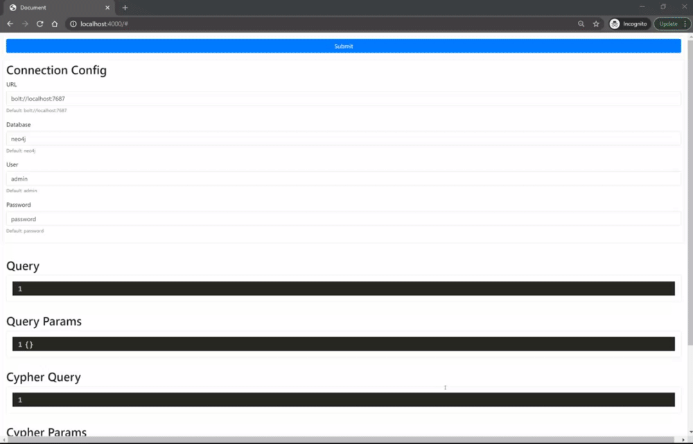

# schemaless-graphql-neo4j

Turn untyped & dynamic GraphQL queries into Cypher.

## Getting Started

```
$ npm install schemaless-graphql-neo4j
```

### Playground

You can get started with the developer playground [here](https://github.com/danstarns/schemaless-graphql-neo4j/packages/playground)



## Quick Start

```js
const { Client } = require("schemaless-graphql-neo4j");
const neo4j = require("neo4j-driver");

const driver = neo4j.driver(
    "bolt://localhost:7687",
    neo4j.auth.basic("neo4j", "password")
);

const client = new Client({ driver });

async function main() {
    const query = `
        {
            MATCH {
                user @node(label: User) {
                    WHERE {
                        name(equal: "Dan")
                    }
                    RETURN {
                        name
                        posts @edge(type: HAS_POST, direction: OUT) {
                            post @node(label: Post) {
                                RETURN {
                                    title
                                }
                            }
                        }
                    }
                }
            }
        }
    `;

    const { MATCH } = await client.run({ query });

    console.log(MATCH.user);
    /*
        [{
            name: "Dan",
            posts: [
                {
                    post: {
                        title: "Checkout schemaless-graphql-neo4j"
                    }
                }
            ]
        }]
    */
}

main();
```

## What is it ? 🧐

GraphQL can be separated into two sections; language & execution. To truly understand this implementation one should first remove them selfs from the conventional execution paradigms, say using Apollo Server, and look towards the pre-made & rich tooling surrounding the language. This implementation fundamentally concerns itself with the AST produced from a given selection. Traversal of the AST enables the translator to generate Cypher via; picking up on Client Directives that give the query context.

Given the below;

```graphql
{
    MATCH {
        user @node(label: User) {
            WHERE {
                name(equal: "Dan")
            }
            RETURN {
                name
                posts @edge(type: HAS_POST, direction: OUT) {
                    post @node(label: Post) {
                        RETURN {
                            title
                        }
                    }
                }
            }
        }
    }
}
```

the following Cypher is produced;

```cypher
MATCH (user:User)
WHERE user.name = "Dan"
RETURN user {
    .id,
    posts: [ (user)-[:HAS_POST]->(posts:Post) | { post: { title: posts.title } } ]
} as user
```

The lack of schema means no validation or type checking is performed, usually the expensive part of GraphQL execution. The flip-side to this is that; you can formulate ad-hoc queries using a maybe more familiar language; GraphQL. Using this language enables developers to receive a JSON like structure, similar in-shape to there formulated query, thus making the response more predictable & easier to manage.

## Usage

### Match

#### Match node

```graphql
{
    MATCH {
        user @node(label: User) {
            RETURN {
                id
            }
        }
    }
}
```

#### Match many nodes

```graphql
{
    MATCH {
        users @node(label: User) {
            RETURN {
                name
            }
        }
        posts @node(label: Post) {
            RETURN {
                content
            }
        }
    }
}
```

#### Match and project relationships

```graphql
{
    MATCH {
        user @node(label: User) {
            RETURN {
                name
                posts @edge(type: HAS_POST, direction: OUT) {
                    node @node(label: Post) {
                        RETURN {
                            title
                        }
                    }
                }
            }
        }
    }
}
```

### Match and project relationship properties

```graphql
{
    MATCH {
        user @node(label: User) {
            RETURN {
                name
                posts @edge(type: HAS_POST, direction: OUT) {
                    post @node(label: Post)
                    properties @relationship {
                        RETURN {
                            since
                        }
                    }
                }
            }
        }
    }
}
```

### Where

#### Operators

##### equal

```graphql
{
    MATCH {
        user @node(label: User) {
            WHERE {
                id(equal: 1)
            }
            RETURN {
                id
            }
        }
    }
}
```

#### Filter Relationships

```graphql
{
    MATCH {
        user @node(label: User) {
            RETURN {
                id
                posts @edge(type: HAS_POST, direction: OUT) {
                    node @node(label: Post) {
                        WHERE {
                            content(equal: "Cool")
                        }
                        RETURN {
                            content
                        }
                    }
                }
            }
        }
    }
}
```

#### Filter By Relationship Property

```graphql
{
    MATCH {
        user @node(label: User) {
            RETURN {
                id
                posts @edge(type: HAS_POST, direction: OUT) {
                    node @node(label: Post) {
                        RETURN {
                            content
                        }
                    }
                    properties @relationship {
                        WHERE {
                            since(equal: "1999")
                        }
                    }
                }
            }
        }
    }
}
```

### Variables

Use the `$` symbol to use variables and provide `variables` map when calling `translation` or `run`;

```js
const { MATCH } = await client.run({ query, variables: { id: "user-id" } }); // OR
const translation = client.translate({ query, variables: { id: "user-id" } }); // OR
```

```graphql
{
    MATCH {
        user @node(label: User) {
            WHERE {
                id(equal: $id)
            }
            RETURN {
                name
            }
        }
    }
}
```

### Create

> TODO

### Update

> TODO

### Delete

> TODO
