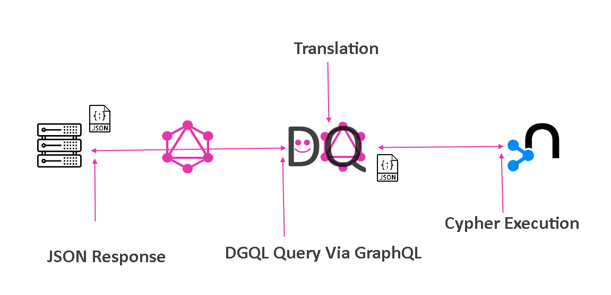

# DGQL

> Next Generation Application Specific Graph Query Language.

[](.)

~~Dynamic GraphQL~~

~~Dans Graph Query Language~~

Dynamic Graph Query Language 👍

## Packages

1. [Language](https://github.com/danstarns/dgql/tree/main/packages/language) - The Javascript Implementation For The DGQL Language

2. [Client](https://github.com/danstarns/dgql/tree/main/packages/client) - Executable Client for DGQL Queries

3. [Builder](https://github.com/danstarns/dgql/tree/main/packages/builder) - DGQL Query Builder

4. [Playground](https://github.com/danstarns/dgql/tree/main/packages/playground) - Graph app Developer playground to issue DGQL queries

## Documentation

- [Documentation](https://github.com/danstarns/DGQL/blob/main/docs/index.md)
- [TCK tests](https://github.com/danstarns/DGQL/tree/main/packages/client/tests/tck/tck-test-files)
- [DGQL Recipes](https://github.com/danstarns/dgql/tree/main/misc/recipes)
- [Blog](https://medium.com/@danstarns/dgql-next-generation-application-specific-graph-query-language-a232e39887e7) - ⚠ In progress

## Examples

See [Examples](./examples/index.md)

## Prerequisites

GraphQL can be separated into two sections; language & execution. To truly grasp this implementation one should first remove themselves from the conventional execution paradigms, say using Apollo Server, and look towards the pre-made & rich tooling surrounding the language. DGQL completely breaks the rules 😲 throws away the runtime and simply focuses on the language.

## What

This implementation, at its core, is a transpiler from GraphQL to Cypher and simply concerns itself with the AST produced from a given selection set. Traversal of the AST enables the translator to generate Cypher from picking up on Client Directives.

Given the below DGQL Query;

```graphql
{
  MATCH {
    user @node(label: User) @where(name: "Dan") {
      PROJECT {
        id
        name
        posts @edge(type: HAS_POST, direction: OUT) @node(label: Post) {
          title
        }
      }
    }
  }
  RETURN {
    user
  }
}
```

<br>

<details>
<summary>Or equivalent DGQL Builder</summary>
<br>

[DGQL Builder](./packages/builder)

```js
const { Builder, node, property, edge } = require("@dgql/builder");

const builder = new Builder();

const [dgql, variables] = builder
  .match({
    user: node({ label: "User" })
      .where({ name: property({ equal: "Dan" }) })
      .project({
        id: property(),
        name: property(),
        posts: edge({
          type: "HAS_POST",
          direction: "OUT",
          node: node({ label: "Post" }),
        }).project({
          title: property(),
        }),
      }),
  })
  .return(["user"])
  .build();
```

</details>

<br>

The following Cypher is produced;

```cypher
CALL {
  MATCH (user:User)
  WHERE user.name = "Dan"
  RETURN user {
      .id,
      .name,
      posts: [ (user)-[:HAS_POST]->(posts:Post) | { title: posts.title } ]
  } as user
}
RETURN user
```

Using the [DGQL Client](https://github.com/danstarns/dgql/tree/main/packages/client) you can execute this Cypher and receive an object like:

```json
{
  "user": [
    {
      "id": "user-id-01",
      "name": "Dan",
      "posts": [{ "title": "Checkout DGQL!" }]
    }
  ]
}
```

<br>

💡 DGQL is just GraphQL, **and not a fork**.

[](.)

## Why

**Why don't you just use Cypher?** - If you are looking for a highly specific answer... Cypher may be the correct tool. If you aren't too familiar with the Cypher, and all you need is a JSON structure, similar in shape to your formulated query, then DGQL is for you. Using a DGQL query will make returning values from the database more predictable & easier to manage.

**Why does it use GraphQL?** - The GraphQL parser is a widely adopted and maintained project, meaning we can lean on its tools and infrastructure. Not only does GraphQL provide a solid foundation but also comes with developers & library authors. Finally, GraphQL directives are extremely useful and enable DGQL to facilitate powerful abstractions behind them.

**Why no Schema?** - This implementation is designed to be lightweight and run anywhere. The lack of schema facilitates this but also means no validation or type checking is performed, usually the expensive part of GraphQL execution.

## Overview

### Retrieve large subgraphs

<!-- prettier-ignore-start -->

```graphql
{
  MATCH {
    blogs @node(label: Blog) {
      PROJECT {
        name
        posts @edge(type: HAS_POST, direction: OUT) @node(label: Post) {
          title
          comments @edge(type: HAS_COMMENT, direction: OUT) @node(label: Comment) {
            content
            authors @edge(type: COMMENTED, direction: IN) @node(label: User) {
              name
            }
          }
        }
      }
    }
  }
  RETURN {
    blogs
  }
}
```

<!-- prettier-ignore-end -->

### Execute custom `@cypher`

Sometimes you may have a highly specific question, Cypher could better help you ask. Use [the `@cypher` directive](./docs/language/cypher.md), in a projection, to break the flow, and execute custom cypher.

```graphql
{
  MATCH {
    movies @node(label: Movie) {
      PROJECT {
        title
        similar
          @cypher(
            arguments: { first: 3 }
            statement: """
            MATCH (this)-[:ACTED_IN|:IN_GENRE]-()-[:ACTED_IN|:IN_GENRE]-(rec:Movie)
            WITH rec, COUNT(*) AS score
            RETURN rec ORDER BY score DESC LIMIT $first
            """
          ) {
          title
          actors @edge(type: ACTED_IN, direction: IN) @node {
            name
          }
        }
      }
    }
  }
  RETURN {
    movies
  }
}
```

### Full CRUD Operations

1. [CREATE](./docs/language/create.md)
2. [MATCH](./docs/language/match.md)
3. [UPDATE](./docs/language/update.md)
4. [DELETE](./docs/language/delete.md)

### Play on your desktop

[Playground](https://github.com/danstarns/dgql/tree/main/packages/playground).

[](https://gyazo.com/88e3a580586197e51e246c763d4f594e)

## Licence

MIT
